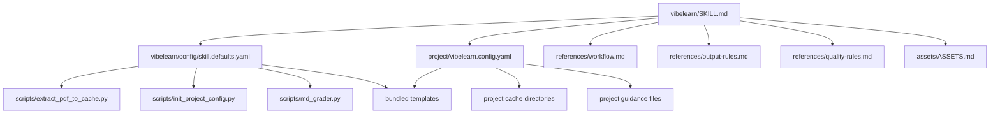

# VibeLearn Architecture

## Layers

VibeLearn is split into three layers:

1. `vibelearn/`
   The reusable skill bundle: `SKILL.md`, scripts, references, assets, and UI metadata.
2. `vibelearn.config.yaml`
   A project-owned config file created inside a course-material repo.
3. `vlcache/`
   Runtime state owned by the project, not by the skill source repo.

This split keeps the skill reusable while still allowing per-project control over outputs, cache layout, templates, and style guidance.

## Design Goals

- Keep the skill bundle self-contained.
- Keep project-specific settings outside the skill bundle.
- Keep runtime cache out of git by default.
- Allow private templates and style references without requiring them to be published.
- Prefer deterministic helper scripts for cache extraction and writeback tasks.

## Key Extension Points

Project config can override:

- `templates.*`
  Use project-owned templates instead of the bundled defaults.
- `guidance.*`
  Use project-owned markdown references for subjective style rules.
- `generation.*`
  Provide lightweight density, answer-detail, and grading hints.

## Runtime Dependency Graph

## Publication Notes

This source repo is intended to stay clean:

- no course PDFs
- no personal note/test/answer output
- no checked-in runtime cache
- no dependency on legacy `AI_space/` content

Private templates should live in end-user project repos, not here.
